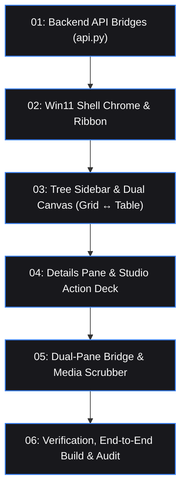

# Orchestrator Session: Windows 11 Native 3-Zone Desktop Explorer

**Session ID**: `orch-20260816-win11-explorer`  
**Status**: Initialized / Ready for Delegation  
**Orchestrator Role**: VibeCode Orchestrator  
**Target System**: CreativeOS Desktop Application (FastAPI + Vanilla JS/CSS)  
**Reference Mockup**: [`c:/CreativeOS/mockups/creativeos_3zone_mockups.html`](file:///c:/CreativeOS/mockups/creativeos_3zone_mockups.html)

---

## 1. Executive Summary & Objective

Transform the CreativeOS GUI from a standard web dashboard into an authentic, high-precision **Windows 11 Native Desktop Explorer** with zero emoji clutter, genuine Fluent Design vector icons, and creative studio superpowers:
1. **Windows 11 Native Chrome**: Multi-tab browsing, interactive breadcrumb address bar, instant search, command ribbon with standard OS tools + CreativeOS macro extensions, and bottom status bar.
2. **Zone 1 (Tree Sidebar)**: Pinned workspaces, category channels, and external drive mountpoints (`C:`, `D:`, `E:`, `NAS`).
3. **Zone 2 (Dual-Mode Canvas)**: Instant toggle between **Large Icons Grid** (Screenshot 1) and **Details Table** (Screenshot 2), plus **Dual-Pane Split** mode.
4. **Zone 3 (Right Details & Action Deck)**: Contextual operations (*Prep Export, Copy Shuttle, Reclaim Cache, Note Sync*) and media preview scrubbing.
5. **Backend Bridges**: Dynamic external drive whitelisting, Git repository cloning, folder adoption, and cross-drive file transfer.

---

## 2. Skills & Workflows Registry

| Component / Task Area | Required Workflows | Injected Skills |
| :--- | :--- | :--- |
| **Backend API & Bridges** | `/mode-code`, `/vibe-build` | `security-audit` |
| **Windows 11 Chrome & Shell** | `/mode-code`, `/vibe-build` | `frontend-design`, `ui-ux-pro-max` |
| **Tree Sidebar & Dual Canvas** | `/mode-code`, `/vibe-build` | `frontend-design`, `ui-ux-pro-max` |
| **Details Deck & Quick Actions** | `/mode-code`, `/vibe-build` | `frontend-design`, `ui-ux-pro-max` |
| **Dual-Pane & Media Scrubber** | `/mode-code`, `/vibe-build` | `frontend-design`, `ui-ux-pro-max` |
| **Review & Acceptance Audit** | `/mode-review`, `/review_code` | `security-audit` |

---

## 3. Task Dependency Flow

---

## 4. Task Decomposition Table

| # | Task File | Primary Mode | Scope & Goal | Dependencies | Status |
|---|---|---|---|---|---|
| **01** | [`01_backend_api_bridges.task.md`](file:///c:/CreativeOS/00_System/Tasks/orchestrator-sessions/orch-20260816-win11-explorer/pending/01_backend_api_bridges.task.md) | `vibe-code` | Add dynamic external mounts, Git clone, folder adoption, and transfer endpoints in `api.py` | None | `Pending` |
| **02** | [`02_win11_shell_chrome.task.md`](file:///c:/CreativeOS/00_System/Tasks/orchestrator-sessions/orch-20260816-win11-explorer/pending/02_win11_shell_chrome.task.md) | `vibe-code` | Implement Windows 11 Tabs, Navigation & Breadcrumb Address Bar, Command Ribbon, and Status Bar | Task 01 | `Pending` |
| **03** | [`03_tree_sidebar_and_dual_canvas.task.md`](file:///c:/CreativeOS/00_System/Tasks/orchestrator-sessions/orch-20260816-win11-explorer/pending/03_tree_sidebar_and_dual_canvas.task.md) | `vibe-code` | Build Navigation Tree Sidebar + Unified Dual-Mode Canvas (Large Icons Grid ↔ Details Table) | Task 02 | `Pending` |
| **04** | [`04_details_pane_and_actions.task.md`](file:///c:/CreativeOS/00_System/Tasks/orchestrator-sessions/orch-20260816-win11-explorer/pending/04_details_pane_and_actions.task.md) | `vibe-code` | Build Right Details Inspector Pane with contextual CreativeOS Action Deck and specifications | Task 03 | `Pending` |
| **05** | [`05_dual_pane_and_media_scrubber.task.md`](file:///c:/CreativeOS/00_System/Tasks/orchestrator-sessions/orch-20260816-win11-explorer/pending/05_dual_pane_and_media_scrubber.task.md) | `vibe-code` | Build Dual-Pane RAID Ingestion Bridge and Media/Waveform Scrubber Player | Task 04 | `Pending` |
| **06** | [`06_verification_and_audit.task.md`](file:///c:/CreativeOS/00_System/Tasks/orchestrator-sessions/orch-20260816-win11-explorer/pending/06_verification_and_audit.task.md) | `vibe-review` | Run full frontend build, verify server-side endpoints, audit against regressions | Task 05 | `Pending` |

---

## 5. Delegation Strategy

* **Sequential Execution**: Tasks 01 through 06 are designed to be completed in sequence to ensure each layer builds upon verified underlying primitives.
* **Non-Destructive Guarantee**: Existing modals (`modal.js`, `reclaimModal.js`), SSE streaming routes, note synchronization, and project metadata are preserved intact.
